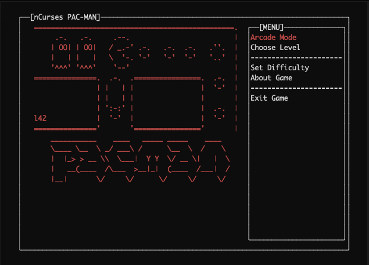
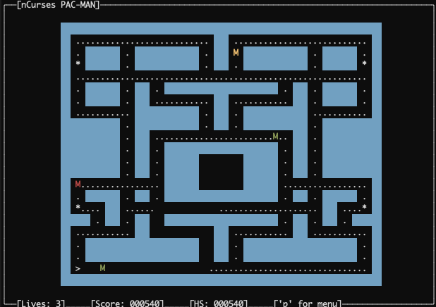

# ncursesPac 

ncurses pacman written in C++ for *NIX systems.

## Screenshots

## Usage

Briefly, the following shell command should configure and
build this package on the default directories:

    $ make compile

Then if you want to play it, do:

    $ make run

## Dependencies

Game only depends on `ncurses` library; it's used to show graphical things on the terminal window.

In Arch linux it comes by default, in Debian-based distros (Ubuntu) you have to install it with command
`apt-get install libncurses5-dev`.

On macOS it is `brew install ncurses`.
